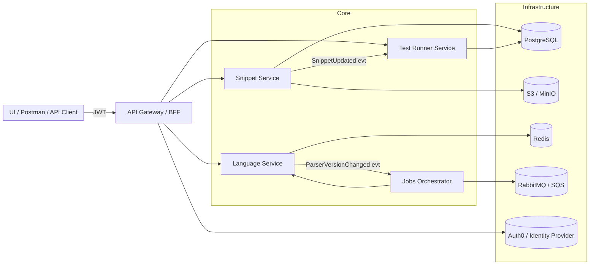

# infra
## System Architecture

````markdown
# Snippet Searcher – Infrastructure

This repository contains the **infrastructure and architecture** for the *Snippet Searcher* platform.  
It defines how all microservices interact, their dependencies, and how to run the full system locally using Docker.

---

## System Architecture

Below is the current **component diagram** for our microservices architecture:


````

---

## Microservices Overview

<table>
  <thead>
    <tr>
      <th>Service</th>
      <th style="width:55%">Responsibility</th>
      <th>Tech Stack</th>
    </tr>
  </thead>
  <tbody>
    <tr>
      <td><b>Snippet Service</b></td>
      <td>Manages CRUD operations for code snippets. Handles metadata, versioning, sharing, and triggers test executions when snippets are updated.</td>
      <td>Spring Boot<br/>PostgreSQL<br/>MinIO</td>
    </tr>
    <tr>
      <td><b>Language Service</b></td>
      <td>Validates, executes, formats, and lints PrintScript snippets. Wraps the PrintScript engine and exposes REST APIs for validation and execution.</td>
      <td>Spring Boot<br/>Redis</td>
    </tr>
    <tr>
      <td><b>Test Runner Service</b></td>
      <td>Manages tests (ordered inputs/outputs), executes them in real time via SSE/WebSockets, and runs automatically when snippets are updated.</td>
      <td>Spring Boot<br/>PostgreSQL</td>
    </tr>
    <tr>
      <td><b>Jobs Orchestrator</b></td>
      <td>Executes background or large-scale tasks (bulk formatting, linting, re-validation). Provides retries, idempotency, and fault tolerance through a message queue.</td>
      <td>Spring Boot<br/>RabbitMQ</td>
    </tr>
  </tbody>
</table>

---

## External Dependencies

<table>
  <thead>
    <tr>
      <th>Component</th>
      <th style="width:65%">Purpose</th>
    </tr>
  </thead>
  <tbody>
    <tr>
      <td><b>Auth0</b></td>
      <td>Authentication and user identity provider. Issues JWT tokens used by all backend services for authorization.</td>
    </tr>
    <tr>
      <td><b>PostgreSQL</b></td>
      <td>Relational database for persisting snippets, tests, and job metadata.</td>
    </tr>
    <tr>
      <td><b>MinIO (S3-compatible)</b></td>
      <td>Object storage for uploaded snippet files, formatted versions, and related assets.</td>
    </tr>
    <tr>
      <td><b>Redis</b></td>
      <td>Used for caching, ephemeral state, and lightweight message passing between services.</td>
    </tr>
    <tr>
      <td><b>RabbitMQ</b></td>
      <td>Message broker that enables asynchronous event-based communication between microservices (e.g., <code>SnippetUpdated</code>, <code>ParserVersionChanged</code>).</td>
    </tr>
  </tbody>
</table>

---

## Running the System Locally

To run all components with Docker:

```bash
docker compose up --build
```

This will start:

* All microservices (`snippet-service`, `language-service`, `test-runner-service`, `jobs-orchestrator`)
* PostgreSQL
* MinIO (on port 9000)
* Redis
* RabbitMQ (management UI on port 15672)

### Environment variables (example)

Each service should define these in its own `.env` or `application.yml`:

```env
SPRING_DATASOURCE_URL=jdbc:postgresql://postgres:5432/snippets
SPRING_DATASOURCE_USERNAME=app
SPRING_DATASOURCE_PASSWORD=app
SPRING_PROFILES_ACTIVE=docker
MINIO_ENDPOINT=http://minio:9000
RABBITMQ_HOST=rabbitmq
REDIS_HOST=redis
AUTH0_DOMAIN=example-auth0-domain
AUTH0_AUDIENCE=example-api-audience
```

---

## Development & CI

Each repository (microservice) must have:

* ✅ **Gradle** build system
* ✅ **Spring Boot** (Web / Data JPA)
* ✅ **Unit & Integration tests** (Testcontainers)
* ✅ **Formatter** (Spotless), **Linter** (Checkstyle/Detekt), **Coverage** (JaCoCo)
* ✅ **GitHub Actions CI** running `./gradlew build test jacocoTestReport`

---

## Repository Structure

```
infra/
├── README.md              # This file
├── docker-compose.yml     # Defines all services + infra
├── diagrams/
│   └── components.md      # Additional diagrams
└── .github/
    └── workflows/
        └── ci.yml         # Build validation for infrastructure repo
```

---

## Next Steps

1. Implement the initial endpoints of each service.
2. Add health checks (`/actuator/health`) for observability.
3. Gradually evolve this diagram as new features or integrations appear.
4. Keep infra and documentation always in sync with deployed services.

---

🧩 *Snippet Searcher – powered by Spring Boot, Gradle, and PrintScript.*
